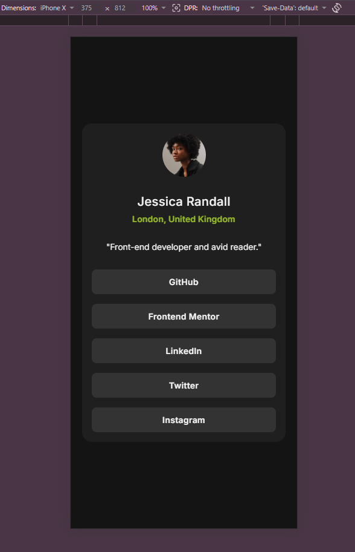
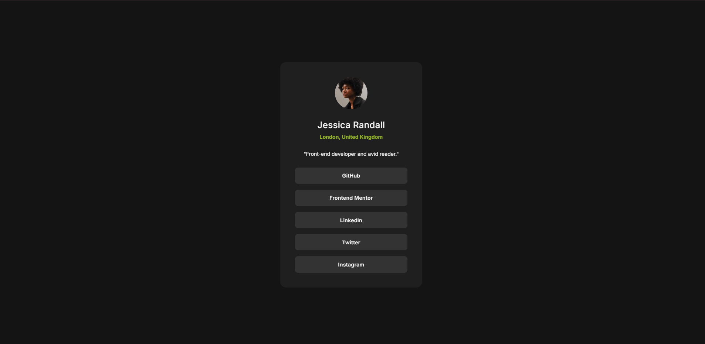
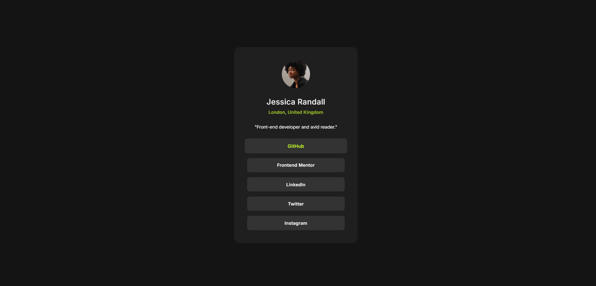

# Frontend Mentor - Social links profile solution

This is a solution to the [Social links profile challenge on Frontend Mentor](https://www.frontendmentor.io/challenges/social-links-profile-UG32l9m6dQ).

## Table of contents

- [Overview](#overview)
  - [The challenge](#the-challenge)
  - [Screenshot](#screenshot)
  - [Links](#links)
- [My process](#my-process)
  - [Built with](#built-with)
  - [What I learned](#what-i-learned)
  - [Continued development](#continued-development)
- [Author](#author)

## Overview

### The challenge

Users should be able to:

- View a responsive social links profile card
- See hover and focus states for interactive elements

### Screenshot

- Mobile


-Desktop


- Hover effect:


### Links

- Live Site URL: https://social-links-profile-pi-ten.vercel.app/

## My process

### Built with

- Semantic HTML5 markup
- CSS custom properties
- Flexbox
- Mobile-first workflow
- clamp() for responsive sizing
- Custom local fonts (Inter)

### What I learned

In this project I practiced building a fully responsive card component using `clamp()` for fluid typography and spacing.

Example:

```css
.card {
  width: clamp(310px, 90vw, 384px);
}
```
I also improved my understanding of layout centering with Flexbox and managing consistent spacing in UI components.

### Continued development

- improve responsive typography system using clamp and scalable values


## Author

- Frontend Mentor - [@mahihex](https://www.frontendmentor.io/profile/marihex)